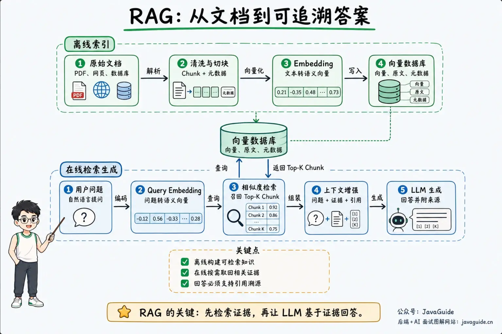
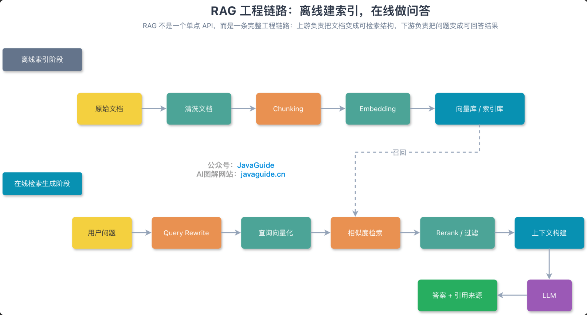
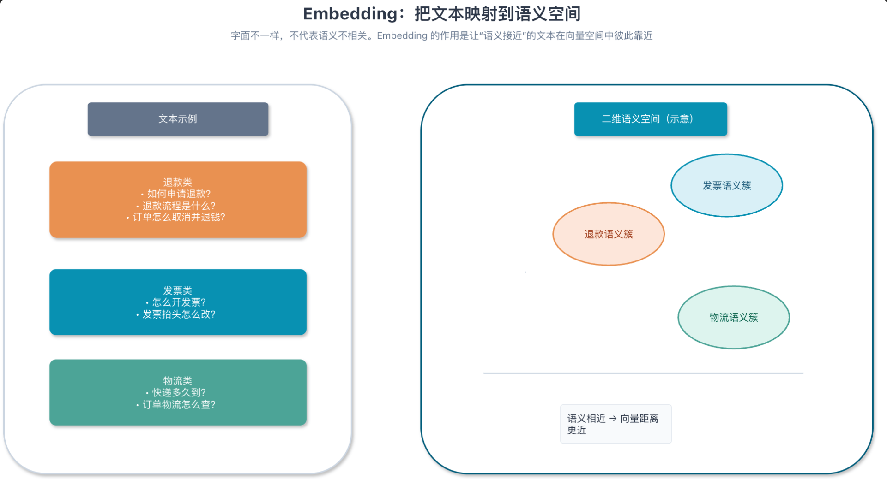

## RAG 基础概念

### 一、什么是 RAG

RAG（Retrieval-Augmented Generation，检索增强生成）是一种将外部知识检索与大模型生成结合起来的应用架构。它的核心思路是：用户提出问题后，系统先从知识库中检索相关内容，再将问题、检索结果和必要的来源信息组织成上下文，交给 LLM 生成答案。

从流程上看，RAG 可以分为离线索引和在线检索生成两个阶段：

1. **离线索引**：导入 PDF、网页、数据库等原始文档，经过解析、清洗和分块后，使用 Embedding 模型将文本转换为向量，并将向量、原文和元数据写入向量数据库。
2. **在线检索生成**：用户提问后，系统将问题转换为向量，在向量数据库中召回相似度最高的文档片段，再把问题与相关证据拼接成上下文，交给 LLM 生成带有来源依据的回答。

RAG 主要解决三个问题：

1. **知识时效性**：预训练模型的知识通常停留在训练数据截止时间。对于新政策、新产品文档和近期事件，RAG 可以动态检索外部知识，将最新内容补充给 LLM。
2. **数据访问与隐私**：企业内部的产品文档、知识库和客户数据通常需要严格控制访问范围。RAG 可以根据用户问题只检索必要片段，减少敏感数据暴露，同时让模型基于企业知识回答问题。
3. **事实可靠性**：LLM 可能生成与事实不符的内容。RAG 通过提供明确的参考文本，让模型基于检索到的证据组织答案，并配合引用、答案评估和拒答机制提升可追溯性。检索质量、上下文噪声和模型遵循能力仍会影响最终结果，因此生产环境还需要完善的校验与反馈闭环。

### 二、RAG 的工作原理

RAG 的工程链路可以分为两个阶段：**离线索引**和**在线检索生成**。离线阶段负责把原始文档加工成可检索的数据结构；在线阶段负责理解用户问题、召回相关证据，并基于证据生成答案。

#### 1. 离线索引阶段

离线索引通常在定时任务或文档更新后执行，主要包括以下步骤：

1. **输入文档**：接入文本文件、PDF、网页、数据库记录等原始数据。
2. **清理文档**：去除 HTML 标签、特殊字符、重复内容和无关噪声，保留有价值的正文信息。
3. **补充元数据**：记录文档标题、来源、时间、分类、权限等信息，为后续过滤和溯源提供依据。
4. **文档分块（Chunking）**：使用分块策略将长文档切分为较小的片段。分块大小需要兼顾语义完整性、Embedding 模型输入长度、上下文窗口和召回粒度。分块过大容易引入无关内容，分块过小又可能丢失上下文。
5. **向量化（Embedding）**：通过 Embedding 模型将文本片段映射为语义向量，使语义相近的文本在向量空间中距离更近。
6. **写入向量库或索引库**：将文本向量、原文片段和元数据一起保存到 Milvus、pgvector、Elasticsearch、OpenSearch 或其他向量存储中。

离线索引的本质，是把原始文档转换为后续可以快速检索、过滤和追溯的知识结构。对于持续更新的知识库，需要通过定时任务或事件触发增量索引，避免每次都重复处理全部文档。

#### 2. 在线检索生成阶段

在线阶段发生在用户提问之后，系统通常按照以下步骤处理：

1. **接收问题**：获取用户的自然语言查询。必要时先进行查询改写或扩展，让问题更容易命中知识库。
2. **查询向量化**：使用与文档相匹配的 Embedding 模型将用户问题转换为查询向量。
3. **相似度检索**：在向量库中召回相似度较高的文档片段，也可以结合关键词检索、元数据过滤或混合检索提高召回效果。
4. **重排序与过滤**：使用 Rerank 模型重新评估候选片段的相关性，过滤重复、低相关或超出权限范围的内容。
5. **上下文构建**：将用户问题、检索证据、来源信息和系统指令组织成 Prompt，控制上下文长度并保留必要的引用关系。
6. **LLM 生成**：由 LLM 基于问题和检索证据生成回答，并在适合的场景中附带文档来源。
7. **结果反馈**：收集用户评价、点击、追问和纠错信息，用于优化查询改写、分块策略、召回参数和答案生成。

RAG 的效果通常取决于检索链路的整体质量，而不是某一个单独组件。出现错误答案时，应分别检查查询改写、召回结果、重排序、上下文构建和最终生成，定位问题所在环节后再进行优化。

### 三、什么是 Embedding？

Embedding 可以理解为一种“语义编码”方法：它使用模型把文本映射成一组浮点数，也就是向量。文本本身由词语和字符组成，而向量则把文本表达为高维空间中的一个位置。语义相近的文本，通常会被映射到向量空间中更接近的位置；语义差异较大的文本，距离通常更远。

例如下面三类问题虽然字面表达不同，但都围绕相近的业务意图：

- 如何申请退款？
- 退款流程是什么？
- 订单怎么取消并退钱？

Embedding 模型会尽量把这些问题映射到相近的区域。这样，用户提问时，系统就可以将问题向量与知识库中的文档向量进行相似度比较，从大量 Chunk 中召回语义上最相关的内容，而不必依赖完全相同的关键词。

#### 1. Embedding 在 RAG 中做什么？

Embedding 主要承担两个任务：**建立文档索引**和**编码用户查询**。

1. **文档向量化**：离线阶段，系统将清洗并分块后的文档转换为向量，同时保存原文、文档来源、时间、权限等元数据。
2. **查询向量化**：在线阶段，系统使用同一个 Embedding 模型将用户问题转换为查询向量。
3. **相似度计算**：系统计算查询向量与文档向量之间的相似度或距离，常见方法包括余弦相似度、内积和欧氏距离。它们关注的角度不同，不能脱离向量归一化方式和索引配置单独比较。

文本转换为向量后，检索系统需要判断哪个文档向量与查询向量最接近。常见度量方式如下：

| 度量方式 | 含义 | 特点 |
| --- | --- | --- |
| 余弦相似度（Cosine Similarity） | 比较两个向量方向是否一致 | 对向量长度不敏感，适合大多数文本语义检索场景 |
| 内积（Inner Product / Dot Product） | 计算两个向量对应维度相乘后的总和 | 如果向量已经进行 L2 归一化，内积与余弦相似度的排序结果通常等价 |
| 欧氏距离（L2 Distance） | 计算两个向量在空间中的直线距离 | 对向量长度更敏感，适合模型或索引明确按 L2 距离训练、优化的场景 |

RAG 中通常优先使用余弦相似度，是因为文本语义检索更关注向量方向，而不是向量长度本身。面试中如果被问到原因，可以概括为：余弦相似度更适合衡量语义方向，且对向量长度不敏感；但实际项目仍要以 Embedding 模型的推荐配置和向量数据库的索引配置为准。

如果系统使用内积，需要确认文档向量和查询向量是否采用了相同的归一化策略；如果使用欧氏距离，则要确认模型训练目标、向量范围和索引参数是否匹配。度量方式不一致，可能导致索引无法命中或召回质量下降。
4. **召回相关片段**：根据相似度排序，取出 Top-K 个候选 Chunk，再交给后续的 Rerank、上下文构建和 LLM 生成环节。

文档和查询通常需要使用同一套 Embedding 模型或兼容的向量空间，否则两边的向量分布不一致，检索结果会明显变差。Embedding 负责“找到可能相关的内容”，最终答案是否准确还取决于分块、召回、重排序和生成环节。

#### 2. 向量维度越高，效果越好吗？

Embedding 的维度表示一个向量包含多少个数值，常见维度包括 768、1024、1536 和 3072。维度是模型结构和训练方式的一部分，不能单独用来判断模型质量。

以 OpenAI 的 Embedding 模型为例，`text-embedding-3-small` 默认输出 1536 维，`text-embedding-3-large` 默认输出 3072 维，并支持通过 `dimensions` 参数降低输出维度。更高的维度通常意味着更大的存储空间、更高的索引成本和相似度计算成本，因此模型选型需要综合考虑召回质量、延迟、存储和预算。

实际项目中，应该使用业务评测集比较不同模型的召回率、相关性和延迟，而不是直接选择维度最高的模型。对于中文、多语言、代码或专业术语场景，还要重点验证模型对目标语料的语义表达能力。

#### 3. 常见 Embedding 模型类型

| 类型 | 代表模型 | 适合场景 |
| --- | --- | --- |
| 闭源 API | OpenAI `text-embedding-3-small` / `text-embedding-3-large`、Cohere Embed、Jina Embeddings API | 追求开箱即用、多语言效果和较少运维 |
| 开源模型 | BGE、GTE、E5、Jina Embeddings 开源模型 | 数据不能出网、需要私有化部署或希望控制成本 |

闭源 API 通常接入简单、模型维护成本低；开源模型便于私有化部署和定制，但需要自行承担模型服务、显存、扩缩容和版本管理成本。选择时可以参考 MTEB 等公开基准，但最终仍应以自己的业务数据和真实查询评测为准。

#### 4. Embedding 的适用边界

Embedding 擅长表达文本之间的语义关系，但它不是实时知识库，也不会自动保证事实正确。遇到刚发布的产品名、内部缩写、行业术语或强时效信息时，仍然需要通过领域数据训练、词典和元数据过滤、关键词检索或混合检索来补足。工程上，Embedding 更适合承担“语义召回”职责，而不是单独负责完整的知识理解和答案生成。

### 四、RAG 和微调怎么选？

“为什么不直接微调？”是 RAG 面试中经常出现的问题。两者解决的问题不同：**RAG 负责为模型补充外部知识，微调负责改变模型的表达方式、任务行为或领域适应能力**。

可以把 RAG 理解为给模型配备一本可以随时更新、按需查阅的参考资料；微调则是通过训练让模型形成更稳定的回答习惯和任务能力。知识更新频繁、需要引用来源时，优先考虑 RAG；输出格式、语气和任务流程需要稳定控制时，微调更合适。

| 维度 | RAG | 微调（Fine-tuning） |
| --- | --- | --- |
| 知识更新 | 更新知识库或向量索引即可 | 通常需要重新准备数据、训练和评估 |
| 数据访问 | 知识保留在外部存储中，按请求检索 | 训练数据中的模式可能被模型参数吸收，需要额外评估合规性和数据治理要求 |
| 事实依据 | 可以附带原文和来源，便于追溯与校验 | 模型仍可能生成错误内容，引用来源能力需要额外设计 |
| 成本结构 | 检索、输入 Token、向量存储和索引成本 | 数据整理、训练 GPU、评测和版本管理成本 |
| 适合场景 | 企业知识库、产品文档、法规政策、实时信息和知识密集型问答 | 固定格式输出、风格适配、领域术语表达和稳定的任务行为 |
| 主要风险 | 检索不到、召回噪声、权限过滤和上下文过长 | 数据过拟合、知识过期、训练成本高以及版本维护复杂 |

RAG 的优势在于知识更新灵活、来源清晰，适合处理不断变化的外部信息；微调的优势在于可以让模型更稳定地遵循特定格式、语气和任务流程。微调并不等于把知识库完整写进模型，RAG 也不负责改变模型的基础行为，选型时应先明确问题属于“知识获取”还是“行为调整”。

两者也可以组合使用：先通过微调让模型掌握领域术语、输出格式和任务边界，再通过 RAG 提供实时知识和可追溯证据。这种方案适合客服、法律、医疗和金融投研等场景，但需要同时维护训练数据、模型版本、知识库和检索链路，工程成本也会随之增加。

面试时可以这样总结：**知识变化频繁、回答需要引用来源，优先使用 RAG；输出风格、格式或任务行为不稳定，考虑微调；既要掌握领域表达，又要使用实时知识，可以组合两者。**

### 五、RAG 有哪些演进阶段？

RAG 一直在持续演进，工程实践中通常按照系统复杂度和可控能力分为三个阶段：**Naive RAG、Advanced RAG 和 Modular RAG**。它们不是彼此割裂的三种技术，而是从基础检索链路逐步发展到可组合、可编排的系统形态。

| 阶段 | 典型链路 | 主要特点 |
| --- | --- | --- |
| Naive RAG | 文档分块 → Embedding → Top-K 检索 → LLM 生成 | 链路最简单，容易实现和验证，适合 Demo 与规模较小的知识库 |
| Advanced RAG | Query Rewrite / HyDE → 混合检索 → Rerank → 上下文压缩 → LLM 生成 | 针对召回不准、上下文噪声和排序不稳定等问题进行专项优化 |
| Modular RAG | 检索器、重排器、压缩器、路由器、生成器等模块按需组合 | 可以根据业务场景动态编排，适合生产系统和复杂 Agent |

#### 1. Naive RAG：先跑通最小链路

Naive RAG 是最基础的实现方式，通常只包含文档切分、向量化、向量检索和 LLM 生成四个步骤。它的优点是结构清晰、依赖较少、便于快速验证知识库是否能够支持目标问题。

但在真实场景中，Naive RAG 往往会暴露出一些问题：查询表达与文档表达不一致时容易召回错误内容，固定 Top-K 可能带来噪声，长文档片段还可能造成上下文过长。因此，Naive RAG 更适合作为原型和基线，用来验证数据源、分块方式与基础召回效果。

#### 2. Advanced RAG：围绕检索质量进行增强

Advanced RAG 会在基础链路上增加查询改写、混合检索、重排序、上下文压缩和结果过滤等能力。

- **Query Rewrite**：改写用户问题，补充关键实体、同义表达和缺失的上下文。
- **HyDE**：先让模型生成假设性答案，再将其转换为向量，用于匹配相关文档。
- **混合检索**：结合向量检索与关键词检索，同时利用语义匹配和精确词匹配能力。
- **Rerank**：对初步召回的候选片段进行二次排序，提高送入上下文的内容质量。
- **上下文压缩**：去除候选片段中的重复和无关内容，在有限上下文窗口内保留有效证据。

Advanced RAG 的核心目标，是提高召回准确率、降低上下文噪声，并让最终生成建立在更可靠的证据之上。

#### 3. Modular RAG：按业务动态编排模块

Modular RAG 将 RAG 拆分为多个可以独立替换和组合的模块，例如查询理解、路由、检索、过滤、重排序、上下文压缩、答案生成和结果评估。系统可以根据问题类型选择不同的处理路径：简单问题走快速检索，复杂问题走多路召回和多轮重排，敏感问题则增加权限校验和人工审核。

这种模块化设计便于独立调试、灰度发布和效果评估，也方便将 RAG 接入 Agent、工作流或多路由系统。代价是系统组件更多，需要额外管理模块之间的接口、状态、延迟和失败处理。

Naive RAG 适合快速验证，Advanced RAG 适合解决召回和上下文质量问题，Modular RAG 则适合复杂业务和生产环境。实际建设时，应先用最小链路跑通数据闭环，再根据评测结果逐步引入需要的模块，而不是一开始就堆叠所有技术。
