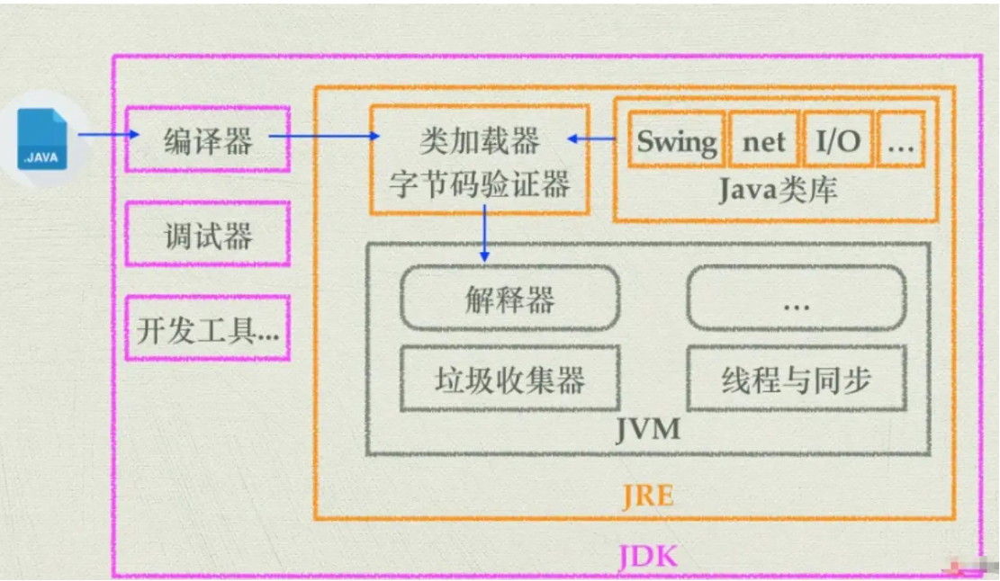

## Java基本概念

### 一、Java 的特点

主要有以下特点：

- **平台无关性**：Java 的“编写一次，运行无处不在”哲学是其最大的特点之一。Java 编译器将源代码编译成字节码（bytecode），该字节码可以在任何安装了 Java 虚拟机（JVM）的系统上运行。
- **面向对象**：Java 是一门严格的面向对象编程语言，几乎一切都是对象。面向对象编程（OOP）特性使代码更易于维护和重用，包括类（class）、对象（object）、继承（inheritance）、多态（polymorphism）、抽象（abstraction）和封装（encapsulation）。
- **内存管理**：Java 有自己的垃圾回收机制，自动管理内存和回收不再使用的对象。这样，开发者不需要手动管理内存，从而减少内存泄漏和其他内存相关的问题。

### 二、JVM、JDK、JRE 三者关系？

它们之间的关系如下：

- **JVM（Java Virtual Machine，Java 虚拟机）**：JVM 是 Java 程序运行的环境，负责将 Java 字节码（由 Java 编译器生成）解释或编译成机器码，并执行程序。JVM 还提供内存管理、垃圾回收和安全性等功能，使 Java 程序具备跨平台性。
- **JRE（Java Runtime Environment，Java 运行时环境）**：JRE 是 Java 程序运行所需的最小环境，包含 JVM 和一组 Java 类库，用于支持 Java 程序的执行。JRE 不包含开发工具，只提供 Java 程序运行所需的环境。
- **JDK（Java Development Kit，Java 开发工具包）**：JDK 是开发 Java 程序所需的工具集合，包含 JRE、编译器（`javac`）、调试器（`jdb`）等开发工具，以及一系列 Java 类库。JDK 提供了开发、编译、调试和运行 Java 程序所需的工具和环境。

它们的包含关系可以简单表示为：



```text
JDK ⊃ JRE ⊃ JVM

### 三、编译型语言和解释型语言的区别？为什么 Java 解释和编译都有？

#### 1. 编译型语言和解释型语言的区别

- **编译型语言**：在程序执行之前，整个源代码会被编译成目标平台的机器码，并生成可执行文件。执行时可以直接运行编译后的代码，速度较快，但对运行平台的依赖较强。典型语言有 C、C++ 等。
- **解释型语言**：在程序执行时，由解释器逐行或逐条解释源代码并执行，通常不会提前生成独立的机器码可执行文件。它的跨平台性较好，但执行速度相对较慢。典型语言有 Python、JavaScript 等。

#### 2. 为什么 Java 解释和编译都有？

Java 采用的是编译和解释相结合的执行方式，具体过程如下：

1. Java 源代码首先由 `javac` 编译为平台无关的字节码（`.class` 文件），这一步发生在程序运行之前。
2. 程序运行时，字节码被加载到 JVM 中。
3. JVM 可以通过解释器逐条解释并执行字节码。
4. 对于执行频率较高的热点代码，JVM 会通过 JIT（Just-In-Time，即时编译器）将其编译成本地机器码，并缓存到 Code Cache 中，后续可以直接执行，从而提高运行效率。

因此，Java 的执行过程既包含编译，也包含解释：

```text
Java 源代码
    ↓ javac 编译
平台无关的字节码（.class）
    ↓ JVM 加载
解释器执行 / JIT 编译热点代码
    ↓
本地机器码
```

这种方式结合了两者的优点：字节码让 Java 具备较好的跨平台性，解释器可以直接执行字节码，而 JIT 则可以将热点代码编译为机器码，提升程序的运行速度。

### 四、值传递和引用传递的区别？

在 Java 中，参数传递只有值传递一种方式，不存在真正的“引用传递”。所谓“引用类型传递”，本质上也是把一个引用值的副本传给方法。

#### 1. 基本类型：传递值的副本

对于基本数据类型（如 `int`、`char` 等），传递的是实际值的副本。修改方法中的参数副本，不会影响原变量的值。

~~~java
public class ValuePassExample {
    public static void main(String[] args) {
        int num = 10;
        changeValue(num);
        System.out.println(num); // 输出 10，原变量未被修改
    }

    public static void changeValue(int a) {
        a = 20; // 仅修改参数副本
    }
}
~~~

#### 2. 引用类型：传递引用的副本

对于对象等引用类型，可以把对象引用理解为对象在内存中的地址。Java 把这个引用值复制一份，再将这份副本传给方法。于是，方法参数和外部变量虽然是两个不同的变量，但它们保存的引用值相同，都指向同一个对象。

因此，你可以通过方法参数保存的引用去修改对象内部的数据，外部变量再次访问这个对象时，也能看到修改后的结果。

但是，方法参数只是外部引用值的副本。如果在方法中让参数指向一个新对象，改变的只是这个副本保存的引用值，外部变量保存的引用值不会改变，仍然指向原来的对象。所以，Java 只有值传递。

~~~java
public class ReferencePassExample {
    static class Person {
        String name;

        Person(String name) {
            this.name = name;
        }
    }

    public static void main(String[] args) {
        Person person = new Person("Alice");

        changeName(person);
        System.out.println(person.name); // 输出 Bob，对象内部数据被修改

        changeReference(person);
        System.out.println(person.name); // 仍然输出 Bob，原引用指向未改变
    }

    // 修改对象内部的数据
    public static void changeName(Person obj) {
        obj.name = "Bob"; // 副本和原引用指向同一个对象
    }

    // 修改副本的指向，不会影响原引用
    public static void changeReference(Person obj) {
        obj = new Person("Charlie"); // 副本指向新对象
    }
}
~~~

简单来说，Java 把对象的引用值（可以理解为对象的内存地址）作为一个值传给方法：

- 基本类型传递值的副本，修改副本不会影响原变量。
- 引用类型传递引用值的副本，可以通过这个副本修改它所指向的对象内部数据，但无法通过这个副本改变外部变量原本指向的对象。

### 五、Java 的八种基本数据类型

Java 支持的数据类型分为两类：基本数据类型和引用数据类型。基本数据类型共有 8 种，可以分为三类：

- **数值型**：整数类型（byte、short、int、long）和浮点类型（float、double）。
- **字符型**：char。
- **布尔型**：boolean。

八种基本数据类型的默认值、占用大小、位数和取值范围如下：

| 数据类型 | 占用大小 | 位数 | 取值范围 | 默认值 | 描述 |
| --- | ---: | ---: | --- | --- | --- |
| byte | 1 字节 | 8 | -128（-2^7）到 127（2^7 - 1） | 0 | 最小的整数类型，适合节省内存，例如在处理文件或网络流时存储小范围整数数据。 |
| short | 2 字节 | 16 | -32768（-2^15）到 32767（2^15 - 1） | 0 | 使用较少，通常用于需要节省内存且数值范围在该区间的场景。 |
| int | 4 字节 | 32 | -2147483648（-2^31）到 2147483647（2^31 - 1） | 0 | 最常用的整数类型，可以满足大多数日常编程中的整数计算需求。 |
| long | 8 字节 | 64 | -2^63 到 2^63 - 1 | 0L | 用于表示非常大的整数。当 int 类型无法满足需求时使用，定义字面量时通常在末尾加 L 或 l。 |
| float | 4 字节 | 32 | 约 -3.4028235E38 到 3.4028235E38 | 0.0f | 单精度浮点数，用于表示小数，精度相对较低，定义字面量时需要在末尾加 F 或 f。 |
| double | 8 字节 | 64 | 约 -1.7976931348623157E308 到 1.7976931348623157E308 | 0.0d | 双精度浮点数，精度比 float 高，是 Java 中表示小数的默认类型。 |
| char | 2 字节 | 16 | U+0000（0）到 U+FFFF（65535） | U+0000 | 用于表示单个字符，采用 Unicode 编码，可以表示多种语言的字符。 |
| boolean | 未明确规定 | 未明确规定 | true 或 false | false | 用于逻辑判断，只有两个取值，常用于条件判断和循环控制等场景。 |

#### 浮点数的科学计数法

Float 和 Double 的较大数值通常以科学计数法表示，结尾的 E 加数字表示在 E 之前的数字要乘以 10 的多少次方。例如：

- 3.14E3 表示 3.14 × 1000 = 3140。
- 3.14E-3 表示 3.14 ÷ 1000 = 0.00314。

需要注意，Float.MIN_VALUE 和 Double.MIN_VALUE 表示的是最小的正非零值，例如 1.4E-45，并不是负数的最小值；浮点类型能表示的最大值分别由 Float.MAX_VALUE 和 Double.MAX_VALUE 表示。

#### 注意事项

- Java 八种基本数据类型的字节数：1 字节（byte、boolean）、2 字节（short、char）、4 字节（int、float）、8 字节（long、double）。其中 boolean 的具体存储大小由 JVM 实现决定，Java 语言规范没有规定其实际占用大小。
- 浮点数的默认类型是 double。如果需要声明 float 类型的常量，必须在末尾加 F 或 f。
- 整数的默认类型是 int。如果需要声明 long 类型的常量，可以在末尾加 L 或 l。
- 八种基本数据类型都有对应的包装类：Byte、Short、Integer、Long、Float、Double、Character 和 Boolean。
- char 类型是无符号的，不能表示负数，取值从 0 开始。
- char 类型是无符号的，不能表示负数，取值从 0 开始。

### 六、Java 的数据类型转换方式及其可能出现的问题？

Java 的数据类型转换主要包括自动类型转换、强制类型转换、字符串转换和引用类型转换。不同类型之间进行转换时，需要特别注意数据溢出、精度损失和类型不兼容等问题。

#### 1. 基本数据类型的转换

##### 自动类型转换（隐式转换）

当目标类型的取值范围大于源类型时，Java 会自动将源类型转换为目标类型，不需要显式进行类型转换。这种转换通常是安全的，也叫**向上转型**。

例如，`int` 可以自动转换为 `long`，`float` 可以自动转换为 `double`：

~~~java
int num = 100;
long bigNum = num; // int 自动转换为 long

float decimal = 3.14f;
double preciseDecimal = decimal; // float 自动转换为 double
~~~

自动类型转换的一般方向如下：

```text
byte → short → int → long → float → double
char → int → long → float → double
```

##### 强制类型转换（显式转换）

当目标类型的取值范围小于源类型时，Java 不会自动转换，需要通过强制类型转换明确告诉编译器允许转换。语法如下：

```java
目标类型 变量名 = (目标类型) 源变量;
```

强制类型转换也叫**向下转型**，可能导致数据溢出或精度损失。

例如，将 `long` 转换为 `int` 时，需要显式使用 `(int)`：

~~~java
long bigNum = 100L;
int num = (int) bigNum; // 将 long 显式转换为 int
System.out.println(num); // 输出 100
~~~

如果源数据超出了目标类型的取值范围，强制转换后可能发生数据溢出：

~~~java
long largeNum = 2147483648L; // 超出了 int 的最大值
int result = (int) largeNum;
System.out.println(result); // 输出 -2147483648，发生数据溢出
~~~

#### 2. 字符串与基本数据类型的转换

Java 可以通过包装类提供的方法完成字符串和基本数据类型之间的转换：

- 字符串转换为整数：`Integer.parseInt("100")`。
- 字符串转换为浮点数：`Double.parseDouble("3.14")`。
- 基本类型转换为字符串：`String.valueOf(100)` 或 `Integer.toString(100)`。

~~~java
String text = "100";
int num = Integer.parseInt(text); // 字符串转 int

double price = Double.parseDouble("3.14"); // 字符串转 double
String result = String.valueOf(2026); // int 转字符串
~~~

#### 3. 类型转换可能出现的问题

##### 数据溢出

当大范围数据类型强制转换为小范围数据类型时，如果原数据超出了目标类型的取值范围，就可能发生数据溢出。转换时通常只保留低位数据，结果可能与原值完全不同：

~~~java
int largeNum = 300;
byte smallNum = (byte) largeNum; // byte 范围是 -128 到 127，结果为 44
~~~

##### 精度损失

浮点数转换为整数时，小数部分会被直接舍弃；`double` 转换为 `float` 时，也可能因为表示精度不同而产生精度损失：

~~~java
double decimal = 3.14;
int integer = (int) decimal; // 结果为 3，小数部分 0.14 被舍弃
~~~

#### 4. 引用类型的转换

引用类型的转换主要包括向上转型和向下转型。

##### 向上转型

子类对象可以自动转换为父类类型，这种转换通常是安全的：

~~~java
class Animal {}
class Dog extends Animal {}

Dog dog = new Dog();
Animal animal = dog; // 子类自动向上转型为父类
~~~

向上转型后，变量的编译时类型是父类，因此只能直接调用父类中定义的方法；但对象实际运行时仍然是子类对象。

##### 向下转型

父类对象转换为子类类型需要显式进行，并且存在类型不兼容的风险。如果父类引用实际指向的不是目标子类对象，运行时会抛出 `ClassCastException`：

~~~java
Animal animal = new Animal();
Dog dog = (Dog) animal; // 运行时抛出 ClassCastException
~~~

进行向下转型前，应该使用 `instanceof` 检查对象的实际类型：

~~~java
if (animal instanceof Dog) {
    Dog dog = (Dog) animal; // 确认是 Dog 对象后再进行转型
}
~~~

这是因为 Java 对象在运行时会记录其真实类型。向下转型时，JVM 会检查对象的实际类型是否与目标类型兼容；如果不兼容，就会抛出 `ClassCastException`。


### 七、为什么用 BigDecimal 而不用 double？

在涉及金额、精确计算等场景时，通常使用 `BigDecimal`，而不是直接使用 `double`。因为 `double` 执行的是二进制浮点运算，而有些十进制小数无法用二进制精确表示，所以计算结果可能出现看起来很奇怪的尾数。

例如：

~~~java
System.out.println(0.05 + 0.01);
System.out.println(1.0 - 0.42);
System.out.println(4.015 * 100);
System.out.println(123.3 / 100);
~~~

输出结果可能是：

~~~text
0.060000000000000005
0.5800000000000001
401.49999999999994
1.2329999999999999
~~~

这些结果并不是 Java 的计算错误，而是因为 `double` 使用有限的二进制位保存浮点数。以 `0.1` 为例，它在十进制中可以精确表示，但转换为二进制后会变成一个无限循环小数，只能截取有限位保存。运算时产生的微小误差，最终就可能表现为多余的小数位。

`BigDecimal` 可以用十进制定点数的方式进行精确计算，适合金额、财务和对精度要求较高的业务场景：

~~~java
import java.math.BigDecimal;

BigDecimal price = new BigDecimal("4.015");
BigDecimal result = price.multiply(new BigDecimal("100"));
System.out.println(result); // 输出 401.500
~~~

创建 `BigDecimal` 时建议传入字符串，不建议直接传入 `double`，否则 `double` 本身已经存在的精度误差可能会被带入 `BigDecimal`：

~~~java
new BigDecimal(0.1); // 不推荐，可能得到 0.100000000000000005...
new BigDecimal("0.1"); // 推荐，能够准确表示 0.1
~~~

#### 为什么 BigDecimal 可以保持精确？

一句话总结：**因为 `BigDecimal` 抛弃了二进制浮点数，改用“大整数 + 小数位数”来直接模拟人类使用的十进制。**

##### 1. 底层原理：它是怎么存储的？

在概念上，`BigDecimal` 的核心可以理解为两个部分：

- **`intVal`**：保存去掉小数点后的整数值。
- **`scale`**：记录小数点右边有多少位。

它的真实值可以用下面的公式表示：

> **真实值 = intVal × 10^(-scale)**

例如：

- **表示 `0.1`**：`intVal = 1`，`scale = 1`，计算结果为 `1 × 10⁻¹ = 0.1`，可以精确表示。
- **表示 `123.45`**：`intVal = 12345`，`scale = 2`，计算结果为 `12345 × 10⁻² = 123.45`，可以精确表示。
- **表示 `4.015`**：`intVal = 4015`，`scale = 3`，计算结果为 `4015 × 10⁻³ = 4.015`，可以精确表示。

也就是说，`BigDecimal` 不需要使用 `1/2`、`1/4`、`1/8` 这样的二进制小数去近似十进制小数，而是直接把小数点右边的数字当作整数保存，再记录小数点的位置。人类如何写十进制小数，`BigDecimal` 就可以如何精确地表示它。

### 八、装箱和拆箱是什么？

装箱（Boxing）和拆箱（Unboxing）是基本数据类型与对应包装类之间进行转换的过程。

- **装箱**：将基本数据类型转换为对应的包装类对象，例如将 `int` 转换为 `Integer`。
- **拆箱**：将包装类对象转换为对应的基本数据类型，例如将 `Integer` 转换为 `int`。

Java 既支持手动装箱和拆箱，也支持自动装箱和自动拆箱。自动装箱主要发生在赋值或方法调用时：

~~~java
// 自动装箱：将 int 转换为 Integer
Integer boxed = 10;

// 自动拆箱：将 Integer 转换为 int
int unboxed = boxed;

System.out.println(boxed);  // 输出 10
System.out.println(unboxed); // 输出 10
~~~

手动装箱和拆箱可以通过包装类的方法完成：

~~~java
int num = 10;
Integer boxedNum = Integer.valueOf(num); // 手动装箱
int originalNum = boxedNum.intValue();  // 手动拆箱
~~~

自动装箱和拆箱本质上仍然是 Java 编译器帮我们调用了类似 `Integer.valueOf()` 和 `Integer.intValue()` 的方法。包装类对象可以用于集合等只能存储对象的场景，例如 `List<Integer>` 不能直接存储 `int`，但 Java 会自动完成装箱。

### 九、Integer 相比 int 有什么优点？

`int` 是 Java 中的基本数据类型，而 `Integer` 是 `int` 对应的包装类。`Integer` 本质上是一个对象，因此相比 `int`，它提供了更多对象层面的能力。

#### 1. 可以用于泛型和集合

Java 的泛型只支持引用类型，不能直接使用基本数据类型。集合需要存储整数时，必须使用 `Integer`：

~~~java
import java.util.ArrayList;
import java.util.List;

List<Integer> numbers = new ArrayList<>();
numbers.add(10); // int 自动装箱为 Integer
numbers.add(20);
~~~

不能写成 `List<int>`，因为 `int` 不是引用类型。

#### 2. 可以表示 `null`

`int` 不能表示“没有值”，未赋值时默认为 `0`；`Integer` 可以表示 `null`。在数据库映射、JSON 解析等场景中，区分“值为 0”和“没有值”非常重要：

~~~java
int count = 0;
Integer score = null; // 表示没有分数，而不是分数为 0
~~~

不过，`Integer` 为 `null` 时不能直接参与运算，否则自动拆箱时会抛出 `NullPointerException`：

~~~java
Integer value = null;
int result = value + 1; // 自动拆箱时抛出 NullPointerException
~~~

#### 3. 提供实用方法

`int` 是基本数据类型，没有方法可以调用；`Integer` 提供了许多实用方法，例如字符串解析、大小比较和进制转换：

~~~java
int num = Integer.parseInt("123"); // 字符串转 int
String binary = Integer.toBinaryString(10); // 转换为二进制字符串
int larger = Integer.max(10, 20); // 获取两个数中的较大值
~~~

#### 4. 可以作为对象使用

`Integer` 可以作为对象传递、存储和比较，也可以调用对象的方法；`int` 只能作为一个数值参与运算：

~~~java
Integer number = 10;
System.out.println(number.toString()); // 作为对象调用方法

Object value = number; // Integer 可以向上转型为 Object
~~~

#### 5. 整数缓存

通过自动装箱或 `Integer.valueOf()` 创建 `Integer` 时，Java 会缓存 `-128` 到 `127` 范围内的整数对象，重复使用这些值时可以减少对象创建。

~~~java
Integer a = 100;
Integer b = 100;
System.out.println(a == b); // true，通常使用缓存对象

Integer c = 200;
Integer d = 200;
System.out.println(c == d); // 不应依赖结果，可能是 false

// 比较 Integer 的数值时，应使用 equals() 或先拆箱为 int
System.out.println(a.equals(b)); // true
~~~

使用 `==` 比较两个 `Integer` 时，比较的是对象引用是否相同，而不是数值是否相等。因此比较包装类的数值时，应优先使用 `equals()`。

#### 6. int 和 Integer 的选择

| 使用场景 | 推荐类型 | 原因 |
| --- | --- | --- |
| 纯数值计算、循环计数 | `int` | 性能开销小，使用简单 |
| 集合和泛型 | `Integer` | 泛型只能使用引用类型 |
| 需要表示“没有值” | `Integer` | 可以使用 `null` |
| 需要调用工具方法 | `Integer` | 包装类提供了丰富的方法 |
| 数据库或 JSON 映射 | `Integer` | 可以区分 `0` 和 `null` |

简单来说：`int` 追求性能和简单，`Integer` 追求对象能力和使用场景。日常数值计算优先使用 `int`，需要集合、泛型、`null` 或对象方法时使用 `Integer`。
